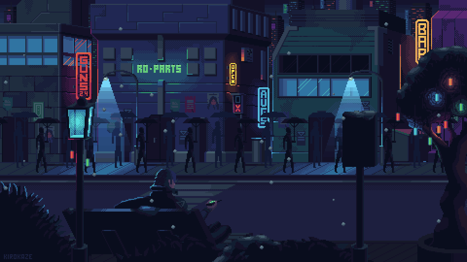

## This section is dedicated to development based on Arduino

Since in PL we traditionally display "Hello world!" on the screen, then in Arduino the path begins with the built-in LED, but this is too simple a program, and I suggest getting a small display and also display "Hello world!" on the screen of our display.
